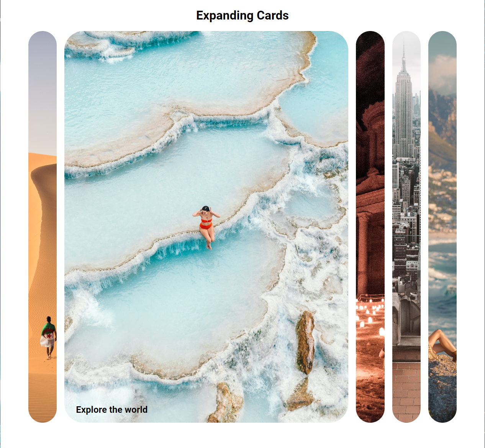
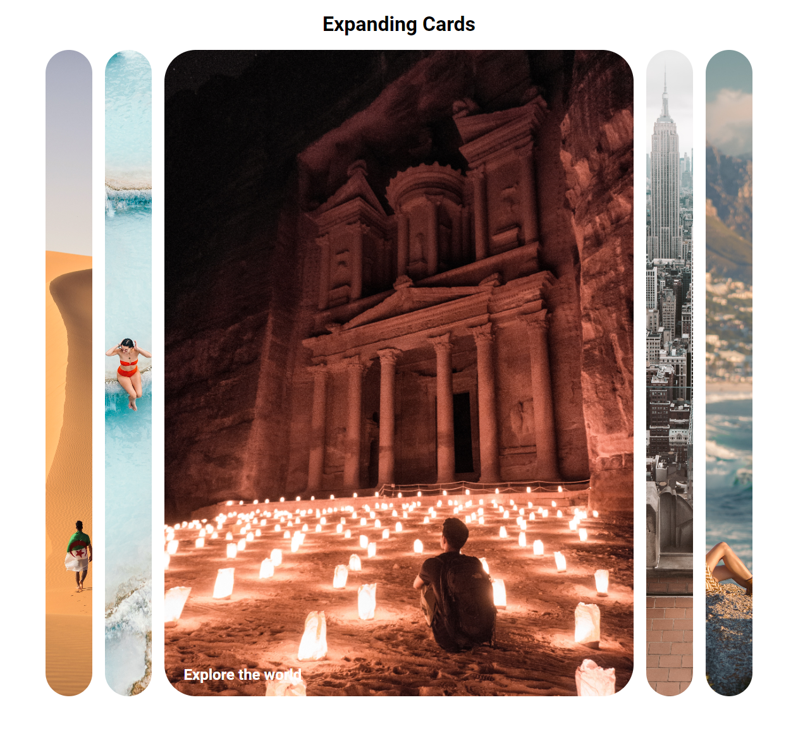
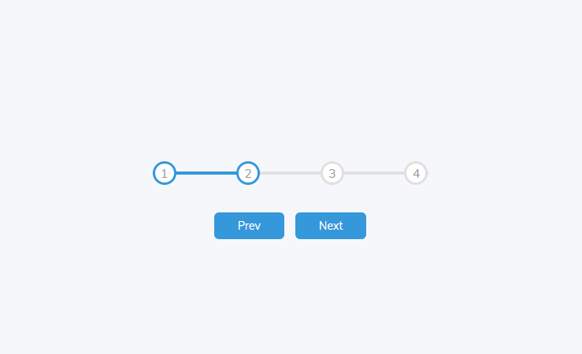
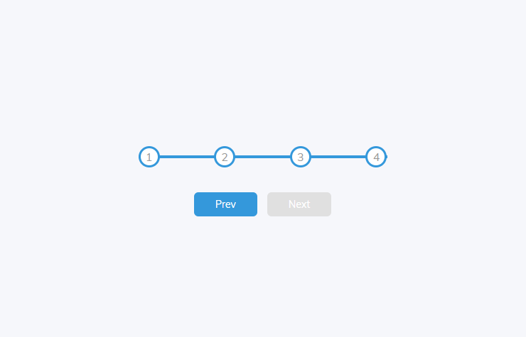

## <b>Expanding Cards</b>
- Utilized flexbox with background images to create clickable containers
- Added event listeners to change the active container shown changing the container sizes based on status

## <b>Progress Steps</b>
- Utilized CSS to create the progress bar and progress circles
- Added event listeners to change the progress using a counter to track the progress

