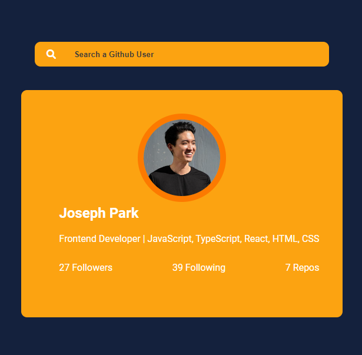

## Here is an accumulation of micro projects for me to master JavaScript/HTML/CSS. 
The goal here is to focus on creating features with JavaScript functionality and to implement good-looking designs that are responsive to media queries.

## Expanding Cards
- Created clickable containers
- Added event listeners to change the active container shown based on status
 

 

## Github Profile Cards
- Created a search bar that displays a Github user's profile information
- Added event listeners to listen to a user's input and used Axios to fetch the data using Github's user API to display the correct info
- Used media thresholds to display the info as a column
 

 

 

## Sticky Nav
- Created a sticky navbar
- Added event listeners to change the sizing and colors as the navbar hits a threshold on the scrolling Y axis.
 

 

## Progress Steps
- Created a progress bar with current/tracked status
- Added event listeners to change the progress status when the buttons are clicked
 

 

